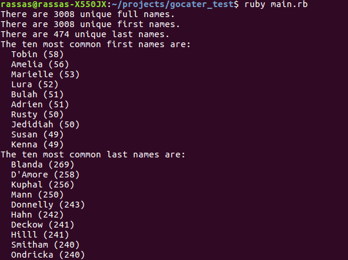

# gocater_test

## How to run:

1 - First you have to clone the project

```
git clone git@github.com:rassas/gocater_test.git
```

2 - Run the **main.rb** file

```
ruby main.rb
```
__________________________________________

Here's an exemple of output for this program :


